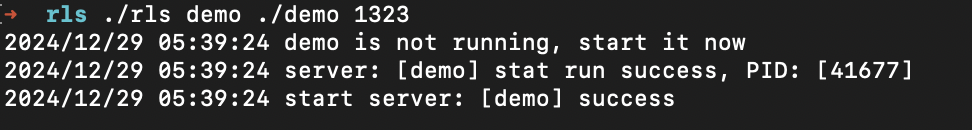

### run listen server
#### <p align="center">服务监听自启</p>
#### <p align="center"><a href="https://github.com/mazezen/rls/releases"></a><a href="https://github.com/mazezen/rls/blob/master/LICENSE"></a><p>




### Usage
```shell
sudo ./rls servername ./serverbinary serverport
```


